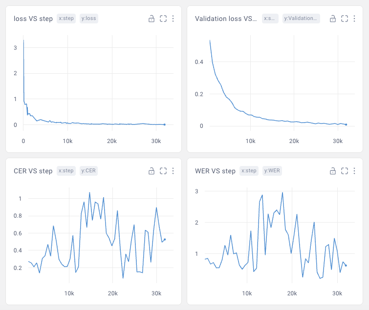

## Huggingface-free Whisper fine-tuning script

This repo is a simple Whisper trainer, directly compatible with https://github.com/openai/whisper. Based on Sanchit Gandhi example, but everything related to Huggingface implementation of Whisper was replaced with original model.

To run, you need to set up your dataset (audio files + csv index file for training and validation sets) PLUS modify config.yaml.

Sorry, I'll not able to answer your questions if something fails, but it is definitely works :bowtie:

### Example of retraining tiny.en to Russian language via Mozilla cv corpus dataset

### Notes:
- Timestamps not implemented, but shouldn't be that big problem to do
- Retraining .en models to other languages not always possible. Whisper is using two different tokenizers: GPT-2 for .en and Tiktoken for multilingual. These tokenizers have different &lt;sot&gt; (&lt;bos&gt;) and &lt;eos&gt; (&lt;pad&gt;) token indices. This could be solved, but Whisper is using different instances of tokenizer in different methods. Fixing it requires modifying Whisper's code. 